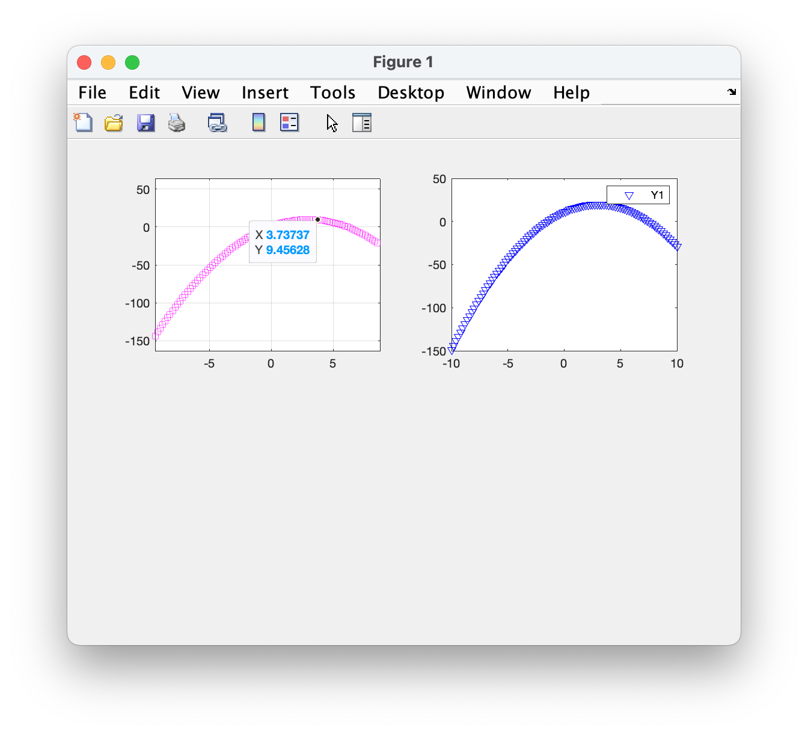

The `subplot` function in MATLAB is used to create multiple plots in a single figure window by dividing the figure into a grid of subplots. This is useful for comparing different datasets or visualizing multiple views of the same data within one figure.



### Syntax

1. **Basic Syntax**:

    ```matlab
    subplot(m, n, p)
    ```

    - `m`: Number of rows in the grid.
    - `n`: Number of columns in the grid.
    - `p`: Position index of the current subplot (starts from 1).

2. **Advanced Syntax**:
    ```matlab
    subplot(m, n, p, 'PropertyName', PropertyValue, ...)
    ```

### Examples

#### Example 1: Basic Usage

Create a 2x2 grid of subplots.

```matlab
% Create a 2x2 grid of subplots
figure;

% First subplot
subplot(2, 2, 1);
x = linspace(0, 2*pi, 100);
y1 = sin(x);
plot(x, y1);
title('Sine Wave');

% Second subplot
subplot(2, 2, 2);
y2 = cos(x);
plot(x, y2);
title('Cosine Wave');

% Third subplot
subplot(2, 2, 3);
y3 = tan(x);
plot(x, y3);
title('Tangent Wave');

% Fourth subplot
subplot(2, 2, 4);
y4 = x.^2;
plot(x, y4);
title('Quadratic Function');
```

#### Example 2: Adjusting Subplot Properties

Customize the appearance of subplots.

```matlab
% Create a 2x2 grid of subplots with customized properties
figure;

% First subplot
subplot(2, 2, 1);
x = linspace(0, 2*pi, 100);
y1 = sin(x);
plot(x, y1, 'r'); % Red line
title('Sine Wave');

% Second subplot
subplot(2, 2, 2);
y2 = cos(x);
plot(x, y2, 'g'); % Green line
title('Cosine Wave');

% Third subplot
subplot(2, 2, 3);
y3 = tan(x);
plot(x, y3, 'b'); % Blue line
title('Tangent Wave');

% Fourth subplot
subplot(2, 2, 4);
y4 = x.^2;
plot(x, y4, 'k'); % Black line
title('Quadratic Function');
```

#### Example 3: Sharing Axes

Share x-axis or y-axis across multiple subplots.

```matlab
% Create a 2x1 grid of subplots with shared x-axis
figure;

% First subplot
subplot(2, 1, 1);
x = linspace(0, 2*pi, 100);
y1 = sin(x);
plot(x, y1);
title('Sine Wave');

% Second subplot
subplot(2, 1, 2);
y2 = cos(x);
plot(x, y2);
title('Cosine Wave');

% Link x-axes of both subplots
linkaxes(findall(gcf, 'type', 'axes'), 'x');
```

### Using `subplot` with Other Functions

You can combine `subplot` with other plotting functions to create complex visualizations.

#### Example: Combining Subplots with 3D Plots

```matlab
% Create a figure with a combination of 2D and 3D plots
figure;

% First subplot: 2D plot
subplot(2, 1, 1);
x = linspace(0, 2*pi, 100);
y = sin(x);
plot(x, y);
title('2D Sine Wave');

% Second subplot: 3D plot
subplot(2, 1, 2);
[X, Y] = meshgrid(linspace(-2, 2, 30));
Z = X .* exp(-X.^2 - Y.^2);
surf(X, Y, Z);
title('3D Surface Plot');
```

### Summary

-   **`subplot(m, n, p)`**: Creates a subplot in a grid layout.
    -   `m`: Number of rows.
    -   `n`: Number of columns.
    -   `p`: Position index.
-   **Customizing Subplots**: Use additional arguments to customize the appearance.
-   **Sharing Axes**: Use `linkaxes` to synchronize axes across subplots.
-   **Combining with Other Functions**: Combine `subplot` with other plotting functions for complex visualizations.

Using `subplot` effectively allows you to create informative and visually appealing figures that can display multiple datasets or different views of the same data. If you have further questions or need specific examples, feel free to ask!
